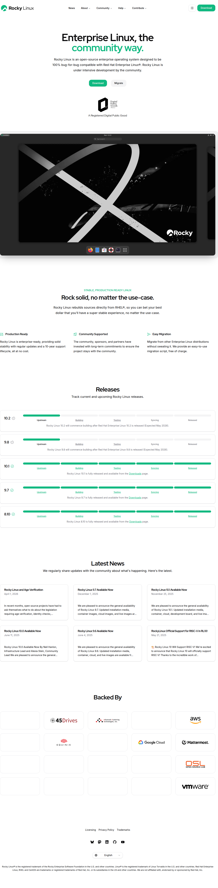

# Visited: https://rockylinux.org/
**Time:** Sat May  9 19:54:00 UTC 2026

## Screenshot

## Raw HTML
[page.html](./page.html)

## Downloaded Media (0 files)
_No media files downloaded_

## Other Links
- [/](/)
- [/_next/image?url=%2Fimages%2Fhome-hero.png&amp;w=3840&amp;q=75](/_next/image?url=%2Fimages%2Fhome-hero.png&amp;w=3840&amp;q=75)
- [/_next/image?url=%2Fimages%2Fsponsors-partners%2Fmontavista.png&amp;w=384&amp;q=75](/_next/image?url=%2Fimages%2Fsponsors-partners%2Fmontavista.png&amp;w=384&amp;q=75)
- [/_next/image?url=%2Fimages%2Fsponsors-partners%2Fopendrives.png&amp;w=384&amp;q=75](/_next/image?url=%2Fimages%2Fsponsors-partners%2Fopendrives.png&amp;w=384&amp;q=75)
- [/_next/image?url=%2Fimages%2Fsponsors-partners%2Fosslab.png&amp;w=384&amp;q=75](/_next/image?url=%2Fimages%2Fsponsors-partners%2Fosslab.png&amp;w=384&amp;q=75)
- [/_next/static/chunks/01xlw8hd842-c.js](/_next/static/chunks/01xlw8hd842-c.js)
- [/_next/static/chunks/03~8viz2tvkbl.js](/_next/static/chunks/03~8viz2tvkbl.js)
- [/_next/static/chunks/03~yq9q893hmn.js](/_next/static/chunks/03~yq9q893hmn.js)
- [/_next/static/chunks/07oy2v5q9ti0n.js](/_next/static/chunks/07oy2v5q9ti0n.js)
- [/_next/static/chunks/08l-ejusrjn9w.js](/_next/static/chunks/08l-ejusrjn9w.js)
- [/_next/static/chunks/0b_zm.m-8gfgf.css](/_next/static/chunks/0b_zm.m-8gfgf.css)
- [/_next/static/chunks/0d~rt8k6qwdqe.js](/_next/static/chunks/0d~rt8k6qwdqe.js)
- [/_next/static/chunks/0gjk-9zjpcwyb.js](/_next/static/chunks/0gjk-9zjpcwyb.js)
- [/_next/static/chunks/0j_.dn6-jfb1e.js](/_next/static/chunks/0j_.dn6-jfb1e.js)
- [/_next/static/chunks/0md2ydrb4cm_~.js](/_next/static/chunks/0md2ydrb4cm_~.js)
- [/_next/static/chunks/0p50~gpo72aza.js](/_next/static/chunks/0p50~gpo72aza.js)
- [/_next/static/chunks/0r_kv6td2wgy5.js](/_next/static/chunks/0r_kv6td2wgy5.js)
- [/_next/static/chunks/0s-_44-khythz.js](/_next/static/chunks/0s-_44-khythz.js)
- [/_next/static/chunks/0t_pw5oqa-pmi.js](/_next/static/chunks/0t_pw5oqa-pmi.js)
- [/_next/static/chunks/0y4va9q6t5.25.js](/_next/static/chunks/0y4va9q6t5.25.js)
- [/_next/static/chunks/turbopack-05jvo5m7bp-7l.js](/_next/static/chunks/turbopack-05jvo5m7bp-7l.js)
- [/_next/static/media/83afe278b6a6bb3c-s.p.0q-301v4kxxnr.woff2](/_next/static/media/83afe278b6a6bb3c-s.p.0q-301v4kxxnr.woff2)
- [/_next/static/media/8780dfd0812b997c-s.p.0-b5-.50j.c.r.woff2](/_next/static/media/8780dfd0812b997c-s.p.0-b5-.50j.c.r.woff2)
- [/download](/download)
- [/legal/licensing](/legal/licensing)
- [/legal/privacy](/legal/privacy)
- [/legal/trademarks](/legal/trademarks)
- [/news](/news)
- [/news/rocky-linux-10-0-ga-release](/news/rocky-linux-10-0-ga-release)
- [/news/rocky-linux-10-1-ga-release](/news/rocky-linux-10-1-ga-release)
- [/news/rocky-linux-9-6-ga-release](/news/rocky-linux-9-6-ga-release)
- [/news/rocky-linux-9-7-ga-release](/news/rocky-linux-9-7-ga-release)
- [/news/rocky-linux-and-age-verification](/news/rocky-linux-and-age-verification)
- [/news/rockylinux-support-for-riscv](/news/rockylinux-support-for-riscv)
- [http://oss-lab.co.kr](http://oss-lab.co.kr)
- [https://45drives.com](https://45drives.com)
- [https://access.redhat.com/errata/RHBA-2024:3135](https://access.redhat.com/errata/RHBA-2024:3135)
- [https://access.redhat.com/errata/RHBA-2025:19954](https://access.redhat.com/errata/RHBA-2025:19954)
- [https://access.redhat.com/errata/RHBA-2025:20949](https://access.redhat.com/errata/RHBA-2025:20949)
- [https://advancedclustering.com/](https://advancedclustering.com/)
- [https://arm.com](https://arm.com)
- [https://aws.com](https://aws.com)
- [https://bsky.app/profile/rockylinux.org](https://bsky.app/profile/rockylinux.org)
- [https://chat.rockylinux.org/rocky-linux/channels/rocky-release-v101](https://chat.rockylinux.org/rocky-linux/channels/rocky-release-v101)
- [https://chat.rockylinux.org/rocky-linux/channels/rocky-release-v102](https://chat.rockylinux.org/rocky-linux/channels/rocky-release-v102)
- [https://chat.rockylinux.org/rocky-linux/channels/rocky-release-v810](https://chat.rockylinux.org/rocky-linux/channels/rocky-release-v810)
- [https://chat.rockylinux.org/rocky-linux/channels/rocky-release-v97](https://chat.rockylinux.org/rocky-linux/channels/rocky-release-v97)
- [https://chat.rockylinux.org/rocky-linux/channels/rocky-release-v98](https://chat.rockylinux.org/rocky-linux/channels/rocky-release-v98)
- [https://ciq.com/products/rocky-linux/](https://ciq.com/products/rocky-linux/)
- [https://cloud.google.com](https://cloud.google.com)

## Stats
- Links: 127
- Media: 0
